# Análise de Dependências e Arquitetura do Sistema

> **Projeto:** Maca Hospitalar Inteligente — Monitoramento e Prevenção de Lesão por Pressão (LPP)  
> **Localização do Documento:** [.agents/architeture/dependencies.md](file:///d:/PrOJETOS/samel-project/.agents/architeture/dependencies.md)  
> **Data:** 2026-08-23 | **Status:** Atualizado (ConfigManager em Cascata + Modal Técnico)  

---

## 1. Visão Geral da Arquitetura do Sistema

O ecossistema é composto por dois serviços desacoplados operando nativamente no sistema operacional da maca:

1. **`apps/edge-service` (Serviço de Borda Nativo 24/7 / Windows Service):**
   - Responsável pela aquisição contínua dos dados da manta sensora FSR (32×64) via USB HID a ~40 Hz, calibração local, pipeline matemático vetorial (NumPy), classificação postural e prevenção de LPP, persistência atômica no SQLite WAL (FIFO 7 dias), API REST, streaming via WebSocket (`/ws/telemetry`), **Gestor Centralizado de Configuração (`ConfigManager`)** com endpoints `GET/POST /api/v1/system/config` e daemon Store-and-Forward (`sync_worker`) para a central hospitalar.
2. **`apps/bed-ui` (Totem / Visualizador Desktop de Leito):**
   - Aplicação visual desacoplada construída em Eel (HTML5/JS/Canvas/Chart.js), conectando-se via WebSocket e REST ao `edge-service` local para renderização do mapa de calor, cards de KPI e **Modal de Configurações Técnicas**.
3. **`tests/edge` (Suíte de Testes Automatizados):**
   - Validação de integridade do `AcquisitionWorker`, endpoints de analítica, persistência SQLite WAL, `ConfigManager` e sincronização Store-and-Forward (**13/13 testes aprovados**).

---

## 2. Diagrama Geral de Dependências e Fluxo de Dados

```mermaid
flowchart TD
    subgraph HARDWARE[" Camada de Hardware & Sensores "]
        MAT["Manta Sensora FSR 32x64\n(WangYing USB HID)"]
    end

    subgraph CONFIG_LAYER[" Camada de Configuração em Cascata "]
        CONF_ENV["Variáveis de Ambiente"]
        CONF_JSON["config.json (Local ou %ProgramData%)"]
        CONF_DOTENV[".env"]
    end

    subgraph EDGE_SERVICE[" apps/edge-service (Serviço do Windows 24/7) "]
        EDGE_CONF["src/core/config.py\n(ConfigManager Dinâmico)"]
        EDGE_API["src/api/server.py\n(FastAPI + WebSockets + REST)"]
        EDGE_ACQ["src/workers/acquisition_worker.py\n(Aquisição Contínua ~40Hz)"]
        EDGE_SERIAL["src/hardware/serial_reader.py\n(Drivers HID/Serial/Simulador)"]
        EDGE_MATH["src/math_engine/pipeline.py\n(Física, Força & EMA)"]
        EDGE_POSTURE["src/providers/posture_monitor.py\n(Classificador & Alerta LPP)"]
        EDGE_STORAGE["src/storage/\n(Calibração Polinomial & Tara)"]
        EDGE_DB["src/database/db_local.py\n(SQLite WAL + FIFO 7 dias)"]
        EDGE_WORKER["src/workers/sync_worker.py\n(Store-and-Forward Daemon)"]
    end

    subgraph BED_UI[" apps/bed-ui (Desktop / Totem Kiosk) "]
        UI_MAIN["main.py\n(Entrypoint da Janela)"]
        UI_BRIDGE["bridge.py\n(Ponte Eel)"]
        UI_STATIC["static/ (HTML/JS/CSS)\n(Dashboard, Modal Config & Canvas)"]
        UI_CLIENT["services/edge_client.py\n(Cliente HTTP + WebSocket)"]
    end

    subgraph CENTRAL_SERVER[" Infraestrutura Hospitalar / Posto Enfermagem "]
        HUB_API["Central Hub / Servidor UTI\n(PostgreSQL / TimescaleDB)"]
        DASH_CENTRAL["Dashboard Posto de Enfermagem"]
    end

    %% Relações Configuração
    CONF_ENV --> EDGE_CONF
    CONF_JSON --> EDGE_CONF
    CONF_DOTENV --> EDGE_CONF

    %% Relações Hardware -> Edge-Service
    MAT -->|USB Packets 40Hz| EDGE_SERIAL

    %% Relações internas Edge-Service
    EDGE_ACQ --> EDGE_SERIAL
    EDGE_ACQ --> EDGE_MATH
    EDGE_ACQ --> EDGE_STORAGE
    EDGE_ACQ --> EDGE_POSTURE
    EDGE_ACQ --> EDGE_DB
    EDGE_ACQ --> EDGE_CONF

    EDGE_API --> EDGE_CONF
    EDGE_API --> EDGE_DB
    EDGE_API --> EDGE_ACQ
    EDGE_API --> EDGE_WORKER

    EDGE_WORKER --> EDGE_CONF
    EDGE_WORKER --> EDGE_DB

    %% Relações Edge-Service -> Bed-UI
    EDGE_API <==|WebSocket /ws/telemetry|==> UI_STATIC
    EDGE_API <==|HTTP REST (Analytics & Config)|==> UI_CLIENT
    UI_BRIDGE --> UI_CLIENT
    UI_MAIN --> UI_BRIDGE
    UI_MAIN --> UI_STATIC

    %% Relações Edge-Service -> Servidor Central
    EDGE_WORKER -.->|"HTTP POST Batches (Store-and-Forward)"| HUB_API
    EDGE_API -.->|WebSocket Broadcast Telemetria| DASH_CENTRAL
```

---

## 3. Tabela de Dependências do Sistema

| Componente Origem | Componente Destino | Tipo / Acoplamento | Justificativa Técnica | Impacto de Falha / Tolerância |
| :--- | :--- | :--- | :--- | :--- |
| **`edge-service / config.py`** | Arquivos `config.json` / `.env` | Baixo (I/O de Configuração) | Lê e persiste parâmetros de rede e identificação do leito. | Fallback automático para defaults se o arquivo estiver corrompido ou ausente. |
| **`edge-service / server.py`** | `edge-service / config.py` | Alto (Injeção de Config) | Alimenta rotas `GET/POST /api/v1/system/config` e orquestra limites. | Permite reconfiguração em runtime sem downtime do leito. |
| **`bed-ui / app.js`** | `edge-service / system/config` | Baixo (REST Local) | Alimenta o Modal Técnico para alteração do nome do leito e IP central. | Interface exibe status e erros amigáveis se o backend estiver reiniciando. |
| **`edge-service / acquisition_worker`** | `edge-service / serial_reader` | Médio (Driver de Hardware) | Lê pacotes USB HID da manta sensora a ~40 Hz. | Se a USB desconectar, o driver tenta reconexão automática. |
| **`edge-service / sync_worker`** | `edge-service / db_local` | Alto (Consumo de Fila) | Busca registros não sincronizados (`synced = 0`) e envia à central. | Sincronização resiliente com Circuit Breaker. |
